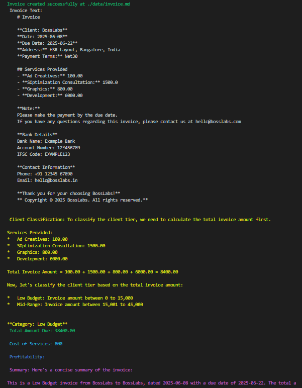

# Invoice-Assistant V2

- LLM changed to gemini-2.0-flash
- Modified States in Graph

# Next Steps:
- Add custom payment terms for different categories of clients. (Low budget, Mid-Budget, Premium)
- Develop UI.

# Output (LLM Generated Invoice processing)

